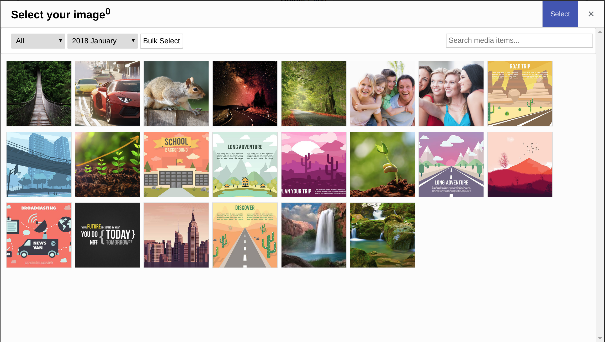

# NgMedia : A media manager plugin for Angular 2 | Angular 4 | Angular 5

Enterprise level image gallery, media manager, posts dependency assigner, inspired by WordPress gallery. You can manage dependencies using this gallery, for file uploads and file select. Avoid uploading files for users, posts or other entities.

You can use the API set for this front-end module. When a user uploads image, they can crop and edit it.





## Installing and usage

You can simply install this package on your Angular 2, Angular 4 and Angular 5 project:

```
npm install ng-media@latest
```

then, you need to add it into your module:

```
import { BrowserModule } from '@angular/platform-browser';
import { NgModule } from '@angular/core';
import { NgMediaModule } from 'ng-media'; // this line you need
import { AppComponent } from './app.component';

@NgModule({
  declarations: [
    AppComponent
  ],
  imports: [
    BrowserModule,
    NgMediaModule // this line you need
  ],
  providers: [],
  bootstrap: [AppComponent]
})
export class AppModule { }
```


Then you can use it's component inside your application, for example update your `app.component.html`:

```
<app-ng-media></app-ng-media>
```

For parameters and attributes, please review the README.


## Using as a gallery selector

When user uploads images, you probably expect that they can select and assign to something, you need to open this dialog programmitically. For this purpose, open the public service.

```
import { Component } from '@angular/core';
import { NgMediaModule, NgMediaService } from 'ng-media'; // this line you need

@Component({
  selector: 'app-root',
  templateUrl: './app.component.html',
  styleUrls: ['./app.component.scss']
})
export class AppComponent {
  
  constructor(
    private ngmedia: NgMediaService, // this line you need
  ) { }

  open() {
    const ref = this.ngmedia.open();
    ref.afterClose().subscribe(items => {
      console.log(items);
    });
  }

}
```

## Live demo

https://owsolutions.github.io/ng-media/


**Keywords:** Gallery Manager, Attachment manager, Attachment uploader, dependency manager for posts, Image uploader

